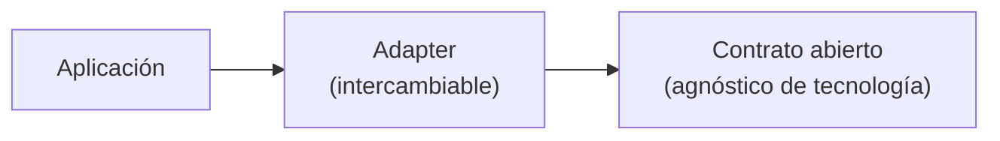

# Nota de referencia: estándares abiertos del ecosistema agéntico

> Referencia breve, no una decisión de arquitectura de nimrod. Existen (o pueden emerger)
> estándares abiertos de interoperabilidad para plataformas agénticas — contratos
> agnósticos de framework/modelo/storage que separan "qué hace un agente" de "qué
> tecnología concreta lo implementa". nimrod no depende de ninguno de estos estándares
> hoy; se anota acá solo para no perder el contexto si en el futuro conviene alinear un
> adapter interno (p. ej. el de identidad) a un contrato de ese tipo en vez de a uno
> propietario.

La idea central, si algún día aplica: una aplicación nunca depende directamente de una
implementación concreta — depende de un adapter que satisface un contrato estable, y el
adapter es lo único sustituible.

Sin roadmap, sin compromiso de adopción — anotado por si sirve de referencia, nada más.
