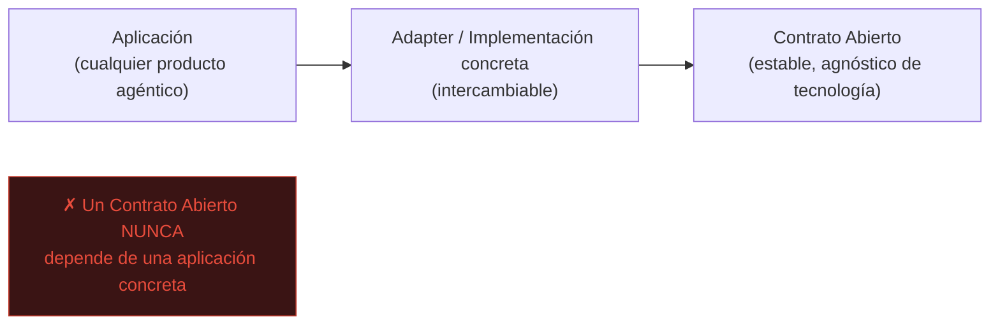
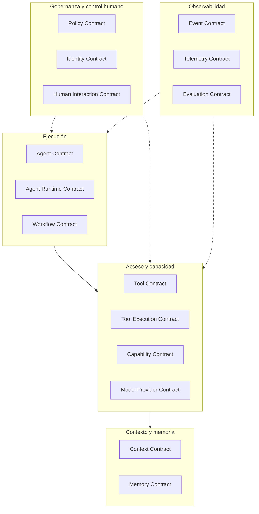
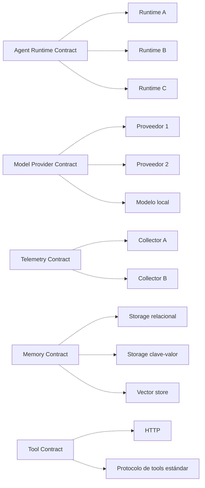
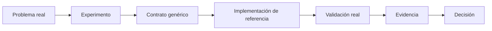
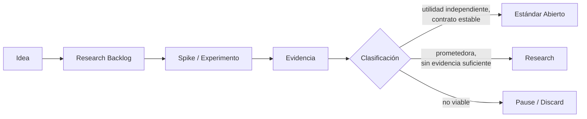
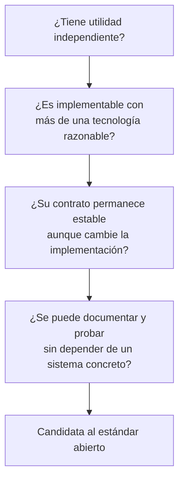
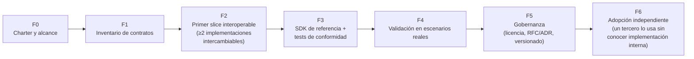

# Arquitectura del Ecosistema Agéntico Abierto

> Big picture de un estándar abierto para productos agénticos: contratos, protocolos y
> capas que cualquier implementación puede consumir. Agnóstico de framework, modelo,
> storage, observabilidad e infraestructura — ninguna tecnología concreta es dependencia
> obligatoria del estándar.

## 1. Dirección de dependencia (regla central)

Las aplicaciones dependen de adapters; los adapters dependen de contratos abiertos —
nunca al revés. Un contrato abierto nunca requiere ni asume una aplicación concreta.

**Regla de prueba:** cualquier aplicación concreta debe poder desaparecer del diagrama del
estándar y este debe seguir teniendo sentido por sí solo.

## 2. Familias de contratos

El activo principal no es una implementación — es un **modelo común de
interoperabilidad**. Familias candidatas (nombres y límites no son API estable todavía;
emergen de experimentos y evidencia):

## 3. Contratos vs. implementaciones intercambiables

Una tecnología concreta puede adoptarse como **implementación de referencia** para
acelerar experimentos, sin volverse dependencia obligatoria del contrato:

El contrato permanece estable aunque la implementación de referencia por debajo cambie.

## 4. De problema real a contrato

La pregunta que importa no es solo "¿funciona esta tecnología?", sino "¿definimos
correctamente el contrato que permitiría sustituirla?".

## 5. Pipeline de nuevas ideas

## 6. Criterios para que una capacidad entre al estándar

## 7. Roadmap fundacional (fases)

## 8. Principio de éxito

El estándar es exitoso si permite: validar contratos antes de industrializarlos, reducir
riesgo arquitectónico, probar tecnologías sustituibles, colaborar con terceros, detectar
acoplamientos incorrectos, crear herramientas útiles fuera de cualquier producto
específico, y aprender de sistemas reales.

El éxito **no** se mide por reproducir ningún producto concreto en abierto — se mide por
la utilidad y estabilidad del contrato en sí mismo, independiente de quién lo implemente.
