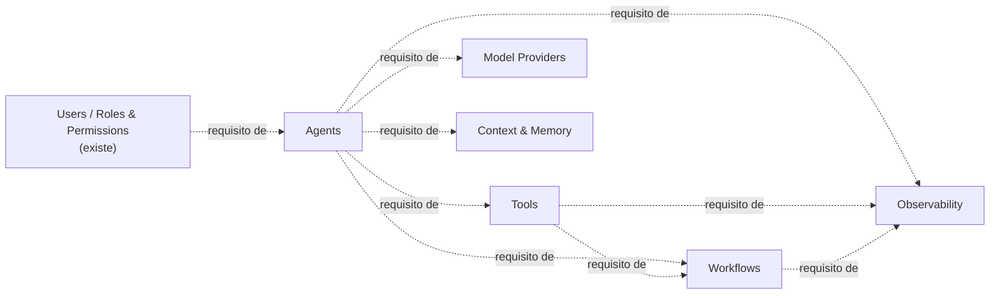

# Sidebar — Estado actual y roadmap de módulos

> Mapa completo del sidebar: qué existe hoy (post `simplify-sidebar-navigation`) y qué
> módulos futuros se suman, uno por uno, solo cuando cada uno tenga backend/contrato real
> detrás — nunca como placeholder. Ver `docs/architecture/ecosystem-architecture.md` para
> el modelo de contratos que sustenta cada módulo futuro.

## Esquema completo

```mermaid
flowchart TD
    Sidebar["Sidebar"]

    Sidebar --> Dashboard["📊 Dashboard<br/><i>existe</i>"]

    Sidebar --> Agents["🤖 Agents<br/><i>futuro</i>"]
    Agents --> AgentsCatalog["Catálogo<br/>(lista, estado, config)"]
    Agents --> AgentsRuns["Ejecuciones<br/>(runs activos/históricos)"]

    Sidebar --> Workflows["🔀 Workflows<br/><i>futuro</i>"]
    Workflows --> WorkflowsCatalog["Definiciones"]
    Workflows --> WorkflowsRuns["Ejecuciones"]

    Sidebar --> Tools["🛠️ Tools<br/><i>futuro</i>"]
    Tools --> ToolsCatalog["Catálogo de tools"]
    Tools --> ToolsScopes["Scopes por agente"]

    Sidebar --> ModelProviders["🧠 Model Providers<br/><i>futuro</i>"]

    Sidebar --> Memory["💾 Context & Memory<br/><i>futuro</i>"]

    Sidebar --> Observability["📈 Observability<br/><i>futuro</i>"]
    Observability --> ObsTraces["Trazas / eventos"]
    Observability --> ObsEvals["Evaluaciones"]

    Sidebar --> Users["👤 Users<br/><i>existe</i>"]
    Users --> UsersList["Lista"]
    Users --> UsersDetail["Detalle"]

    Sidebar --> RolesPerms["🔐 Roles & Permissions<br/><i>existe</i><br/>(+ aprobaciones humanas, futuro)"]

    classDef existing fill:#123524,stroke:#2ecc71,color:#eafaf1
    classDef future fill:#2a2a3d,stroke:#7f8fa6,color:#dcdde1,stroke-dasharray: 4 3

    class Dashboard,Users,UsersList,UsersDetail,RolesPerms existing
    class Agents,AgentsCatalog,AgentsRuns,Workflows,WorkflowsCatalog,WorkflowsRuns,Tools,ToolsCatalog,ToolsScopes,ModelProviders,Memory,Observability,ObsTraces,ObsEvals future
```

**Leyenda:** verde sólido = existe hoy (post-cutover de `simplify-sidebar-navigation`).
Gris punteado = módulo futuro, entra solo cuando su contrato tenga adapter real detrás.

## Detalle por módulo

| # | Módulo | Estado | Ruta base | Capability OpenSpec | Contrato(s) que cubre |
|---|---|---|---|---|---|
| 1 | Dashboard | ✅ Existe | `/dashboards/analytics` | `dashboard` *(implícito, sin spec propio aún)* | — |
| 2 | Agents | 🔲 Futuro | `/agents` | `agents` | Agent Contract, Agent Runtime Contract |
| 3 | Workflows | 🔲 Futuro | `/workflows` | `workflows` | Workflow Contract |
| 4 | Tools | 🔲 Futuro | `/tools` | `tools` | Tool Contract, Tool Execution Contract, Capability Contract |
| 5 | Model Providers | 🔲 Futuro | `/model-providers` | `model-providers` | Model Provider Contract |
| 6 | Context & Memory | 🔲 Futuro | `/memory` | `memory` | Context Contract, Memory Contract |
| 7 | Observability | 🔲 Futuro | `/observability` | `observability` | Event Contract, Telemetry Contract, Evaluation Contract |
| 8 | Users | ✅ Existe | `/apps/user/list` | `auth` | Identity Contract |
| 9 | Roles & Permissions | ✅ Existe | `/apps/roles`, `/apps/permissions` | `auth` | Policy Contract *(+ Human Interaction Contract, futuro — como nuevo tipo de regla, no módulo aparte)* |

## Orden de entrada (dependencias funcionales, no jerarquía de sidebar)

Todos son grupos **hermanos** en el sidebar (ver esquema arriba) — este diagrama solo dice
qué debe tener backend real antes de que el siguiente tenga sentido, no quién contiene a
quién. Ej.: "Agents depende de Auth" significa que un agente necesita una identidad/rol
que lo autorice, no que "Agents" viva dentro del grupo "Users".

`Agents` es el primer módulo nuevo viable (depende solo de auth, ya resuelto).
`Observability` va último — necesita ejecución real de agentes/tools/workflows para tener
algo que trazar.

## Regla de entrada (sin excepción)

Un módulo entra al sidebar cuando:

1. Su contrato (familia de la tabla) tiene un adapter concreto real implementado detrás
   (intercambiable, nunca nombrado en la UI/rutas/config — mismo patrón que
   `server/auth/rumbor-adapter.ts` para Identity Contract hoy).
2. Tiene su propia capability en `openspec/specs/<módulo>/spec.md`, con su propio ciclo de
   proposal → design → approval-gate → implementación, igual que `auth`.
3. Nunca se agrega nav apuntando a una página vacía o "coming soon" — viola el contrato de
   entrega de este repo (`AGENTS.md`: no placeholders, no stubs).

Los nombres de módulo/ruta son de dominio (`agents`, `tools`, `observability`), nunca de
proveedor o framework concreto — mantiene el sidebar agnóstico de qué implementación hay
detrás, igual que el estándar abierto en `ecosystem-architecture.md`.
